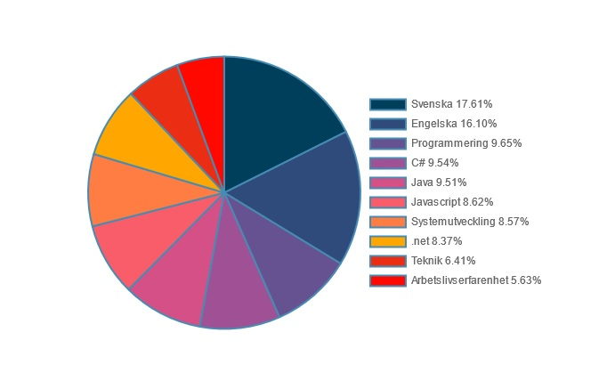
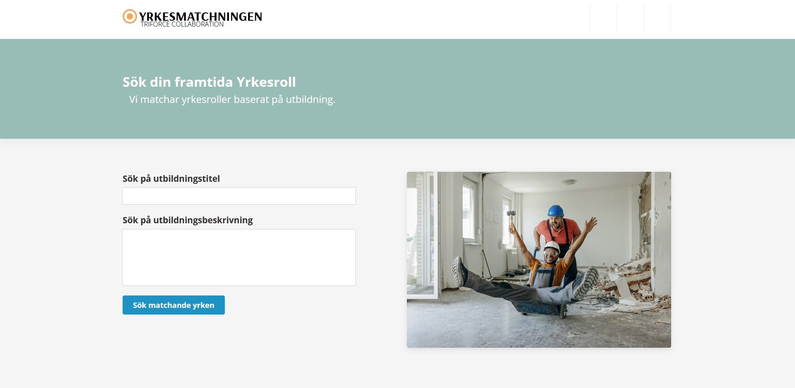

## Kompetensökaren - Match occupations based on education title and education description

This application takes use of arbetsförmedlingens open api and designsystem by finding occupations based of user inputs (worktitles and work descriptions). All matches will in return show a graph listing the top 10 competencies for that occupation.

## Codestack :
 	    	

## Authors

- [@existenztim](https://github.com/existenztim)
- [@MattiasHeurlin](https://github.com/MattiasHeurlin)
- [@vera83](https://github.com/vera83)
